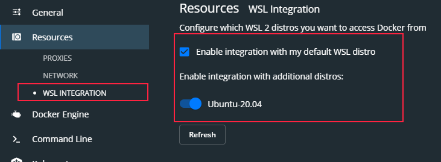

After some internal debates with myself, I found that the best option for me to re-start blogging was to return to basics and get a flat and easy to maintain blog. 

Since I found myself writing a lot of code in github and maintaining lots of Markdown documents and Python Notebooks... the main reason to choose Jekyll was because of [GitHub Pages](https://pages.github.com/). In this post, i want to help you to start blogging with GitHub Pages and maintain your blog with the strategy i found interesting: Docker + github branches

## Prerequisites

I´m using Windows 10 as my setup, but you can use any linux or Mac distro you want, since everything used here is opensource linux based code:

- [Windows 10 2004 update](https://blogs.windows.com/windowsexperience/2020/05/27/how-to-get-the-windows-10-may-2020-update/)
- [Docker version >=2.3.0.1](https://www.docker.com/products/docker-desktop)
- [Enable WSL2 on Windows10](https://docs.microsoft.com/en-us/windows/wsl/install-win10)
- [Ubuntu 20.04 from windows store](https://www.microsoft.com/en-us/p/ubuntu-2004-lts/9n6svws3rx71?activetab=pivot:overviewtab)

>NOTE: Those requisites are important, because with previous version of Windows 10, WSL and docker, the blog will not start correctly

<!--end_excerpt-->

## Setup

### Configure docker

Check the WSL2 integration on your Docker configuration


And set up the distro you want to use with docker


### Create your repository

First action to do is follow the [official instructions](https://guides.github.com/features/pages/) and create your github page.

>TIP: After creating your repository, go and clone any Jekyll theme preconfigured (I´m using [portfolio-iro](https://github.com/rohanchandra/type-theme/))

### Setup your docker

One of the main reasons i choose Jekyll was because i can run it in a container to quickly edit and review my posts before uploading to the site.

1) Create a _docker-compose.yml_ file in the root directory

2) Add the following contents

```yml
version: '2.2'

services:
  jekyll:
    image: jekyll/jekyll:latest
    command: jekyll serve --watch --force_polling --verbose
    ports:
      - 4000:4000
    volumes:
      - .:/srv/jekyll
```

This will ensure that your container will not only start your blog locally, but will be refreshing your site after each "save" you are doing on the markdown file containing your post. This is a very convenient way to edit material and see how it renders in your blog when you commit the change to the main branch.

3) Execute "_docker-compose up_" 

4) Open in browser [http://127.0.0.1:4000/](http://127.0.0.1:4000/)

5) Start [blogging as usual](https://jekyllrb.com/docs/step-by-step/08-blogging/) :) 


## Tips

### Branches

To help you creating new posts and testing capabilities (like updating look and feel of your blog for example), you only need to **create a branch of your repo**, and work on that branch. 

For example...in my case, I created a branch called "_vNext_" where I´ll create the new posts. The only thing to do to publish the post then will be to do a Pull request with my main branch :)

I´m also adding some kind of protection to myself, by requiring manual pull request reviewing...this will hopefuly minimize  mistakes from myself :)


### Images

To reference images in your markdown files, remember to point to the relative path from the root directory:

This will **not** render the image correctly:

```markdown
     
```

This will render the image correctly:
```markdown
     
```