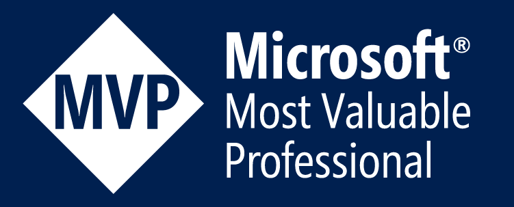

# Enrique Catalá Bañuls

 

### Curriculum Vitae

### Microsoft Transcript

See my official [microsoft transcript](https://mcp.microsoft.com/Anonymous/Transcript/Validate)

> Transcript ID: 977266 - Access Code: enriquecatala

# BIO

## English

Technical leader at [SolidQ](https://www.solidq.com/) , [Microsoft Data Platform MVP](http://mvp.microsoft.com/es-es/mvp/Enrique%20Catala-5000312),  Computer engineer graduated with honors and Microsoft Certified Trainer ( MCT ). My main role as [Data Engineer](https://docs.microsoft.com/en-us/learn/certifications/azure-data-engineer) is focused on the SQL Server relational engine. I´m passionate on solving performance problems in [OLTP](https://es.wikipedia.org/wiki/OLTP) systems (database, dotnet and [bare metal](https://en.wikipedia.org/wiki/Bare_machine)). Also specialized in the definition and implementation of reliable high availability environments in Azure and on premises, where I successfully led more than 150 projects not only in Spain but in different countries like USA , Netherlands , Mexico , Saudi Arabia, Austria... I´m the principal architect of the SolidQ solutions called [HealthCheck](http://www.solidq.com/wp-content/uploads/2016/10/healthcheck_ES_v4_ES_l.pdf) , [QueryAnalytics](https://powerbi.microsoft.com/es-es/partner-showcase/solidq-solidq-tsql-query-analytics-en/) and DatabaseObfuscator. Regular speaker at  [SolidQ SUMMIT](https://training.solidq.com/es/solidq-summit/), member and speaker at [SQL PASS in Spain](http://www.sqlpass.es/) and Latin America,  staff member of the [Madrid´s SQLSaturday](https://www.sqlsaturday.com/904/EventHome.aspx) edition. I´m trying always to help people with both my personal [GitHub account]( https://github.com/enriquecatala/) and the [SolidQ Blog](http://blogs.solidq.com/es/sql-server/)  with my colleagues of SolidQ.

### Short

Microsoft  Data Platform MVP, Computer Engineer and Microsoft Certified Trainer. Working as Technical Leader for @SolidQ with focus on SQL Server scalability , performance and High availability environments.

#### Ultra-short

Microsoft Data Platform MVP, Computer Engineer and Technical Leader at SolidQ

## Castellano

Technical Leader en [SolidQ](https://www.solidq.com/), [Microsoft Data Platform MVP](http://mvp.microsoft.com/es-es/mvp/Enrique%20Catala-5000312), Ingeniero en informática, Microsoft Certified Trainer (MCT). Mi rol principal como [Ingeniero de datos](https://docs.microsoft.com/en-us/learn/certifications/azure-data-engineer) está centrado en el motor relacional SQL Server principalmente. Soy un apasionado de la resolución de problemas de rendimiento en sistemas [OLTP](https://es.wikipedia.org/wiki/OLTP) complejos (bbdd, dotnet y hardware). Especializado en la implementación de sistemas de alta disponibilidad confiables tanto en entorno Cloud como en OnPremises, donde he llevado con éxito mas de 150 proyectos no solo en España sino en diferentes paises como EEUU, Holanda, Arabia Saudí, Austria, Mexico,…Soy el arquitecto principal de las soluciones llamadas [HealthCheck](http://www.solidq.com/wp-content/uploads/2016/10/healthcheck_ES_v4_ES_l.pdf), [QueryAnalytics](https://powerbi.microsoft.com/es-es/partner-showcase/solidq-solidq-tsql-query-analytics-en/) y DatabaseObfuscator de SolidQ. Ponente habitual del [SolidQ SUMMIT](https://training.solidq.com/es/solidq-summit/), miembro y ponente en [SQL PASS en España](http://www.sqlpass.es/) como Iberoamérica, miembro de organización de [SQLSaturday de Madrid](https://www.sqlsaturday.com/904/EventHome.aspx), colaboro con Microsoft realizando conferencias relacionadas con la plataforma de datos y .NET.  Mantengo mi [cuenta Github](https://github.com/enriquecatala/)  como el [blog de SolidQ](http://blogs.solidq.com/es/sql-server/) con colegas de SolidQ.

### Corta

Microsoft  Data Platform MVP, Ingeniero en Informática y Microsoft Certified Trainer. Trabajo como Technical Leader para @SolidQ con foco en alta disponibilidad, escalabilidad y rendimiento de la plataforma de datos de Microsoft.

#### Ultra-corta

Microsoft Data Platform MVP, Ingeniero Informático y Technical Leader en SolidQ
